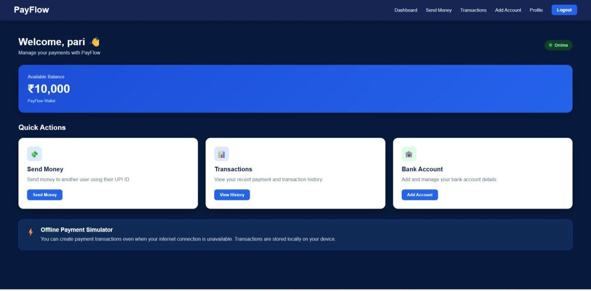

# 💳 PayFlow

<p align="center">


</p>
<p align="center">
  <b>⚡ An Offline-First Payment Simulator built with React + Vite</b>
</p>

<p align="center">
  💰 Send Money &nbsp; • &nbsp;
  📊 Track Transactions &nbsp; • &nbsp;
  📡 Work Offline &nbsp; • &nbsp;
  🔄 Sync Later
</p>

---

## ✨ Project Preview

<p align="center">
  
</p>

<p align="center">
  <b>🚀 PayFlow Dashboard</b>
</p>

---

## 🚀 Live Demo

<p align="center">

<a href="https://payflow-upi-management-system.vercel.app">
  <b>🌐 Open PayFlow Live</b>
</a>

</p>

---

## 📌 About PayFlow

**PayFlow** is an offline-first payment simulator built using **React and Vite**.

The main goal of this project is to demonstrate how a payment application can continue working when the internet connection is unavailable.

PayFlow uses **LocalStorage** for local data persistence and **Progressive Web App (PWA)** technology for offline access.

> ⚠️ This is an educational simulator and does not perform real UPI or bank transactions.

---

## 🚀 Features

| Feature | Status |
|---|---|
| 🔐 User Registration & Login | ✅ |
| 💰 Wallet Balance | ✅ |
| 💸 Send Money Simulation | ✅ |
| 🏦 Add Bank Account | ✅ |
| 📊 Transaction History | ✅ |
| 📡 Offline Mode | ✅ |
| 🔄 Offline Transaction Sync | ✅ |
| 💾 LocalStorage Persistence | ✅ |
| 📱 Responsive UI | ✅ |
| ⚡ PWA Support | ✅ |

---

## 🔄 How Offline Payment Works

```text
                 💳 PAYFLOW
                      │
                      ▼
              🌐 Internet Available
                      │
                      ▼
                 💸 Send Money
                      │
                Internet Lost
                      │
                      ▼
               💾 LocalStorage
                      │
                      ▼
              🟡 Offline Pending
                      │
             Internet Restored
                      │
                      ▼
                 🔄 Sync
                      │
                      ▼
                 🟢 Synced
```

---

## 🛠️ Tech Stack

### Frontend

- ⚛️ React.js
- ⚡ Vite
- 🟨 JavaScript
- 🎨 HTML5
- 🎨 CSS3

### Offline & PWA

- 💾 LocalStorage
- ⚡ Service Worker
- 📱 Web App Manifest
- 🔌 vite-plugin-pwa

### Tools

- VS Code
- Git
- GitHub
- Chrome DevTools

---

## 📸 Screenshots

### 🏠 Dashboard

<p align="center">
  
</p>

---

## 📂 Project Structure

```text
Payflow/
│
├── frontend/
│   ├── src/
│   │   ├── components/
│   │   │   └── ProtectedRoute.jsx
│   │   │
│   │   ├── pages/
│   │   │   ├── Login.jsx
│   │   │   ├── Register.jsx
│   │   │   ├── Dashboard.jsx
│   │   │   ├── SendMoney.jsx
│   │   │   ├── Transactions.jsx
│   │   │   ├── AddAccount.jsx
│   │   │   └── Profile.jsx
│   │   │
│   │   ├── utils/
│   │   │   └── storage.js
│   │   │
│   │   ├── App.jsx
│   │   ├── App.css
│   │   └── main.jsx
│   │
│   ├── public/
│   ├── vite.config.js
│   ├── package.json
│   └── index.html
│
├── screenshots/
│   ├── dashboard.png
│   ├── send-money.png
│   ├── transactions.png
│   └── profile.png
│
└── README.md
```

---

## ⚙️ Run Locally

### 1. Clone the repository

```bash
git clone https://github.com/pariraj18/payflow-upi-management-system
```

### 2. Go to the frontend directory

```bash
cd Payflow/frontend
```

### 3. Install dependencies

```bash
npm install
```

### 4. Start the development server

```bash
npm run dev
```

The application will run at:

```text
http://localhost:5173
```

---

## 🏗️ Production Build

Create a production build:

```bash
npm run build
```

Preview the production build:

```bash
npm run preview
```

---

## 📡 PWA & Offline Support

PayFlow uses a **Service Worker** to cache the application and allow it to work without an active internet connection.

The application has been tested for:

- ✅ Offline page loading
- ✅ Offline registration
- ✅ Offline login
- ✅ Offline balance management
- ✅ Offline account addition
- ✅ Offline money transfer simulation
- ✅ Offline transaction storage
- ✅ Transaction synchronization

---

## 🔮 Future Improvements

The project can be extended into a full-stack application with:

- 🚀 Java Spring Boot backend
- 🗄️ MySQL database
- 🔐 JWT authentication
- 🌐 REST APIs
- ☁️ Cloud synchronization
- 💳 Payment gateway integration
- 👥 User-to-user transactions

---

## ⚠️ Disclaimer

**PayFlow is an educational payment simulator.**

It does not perform real:

- UPI payments
- Bank transfers
- Financial transactions

All current user and transaction data is stored locally in the browser using **LocalStorage**.